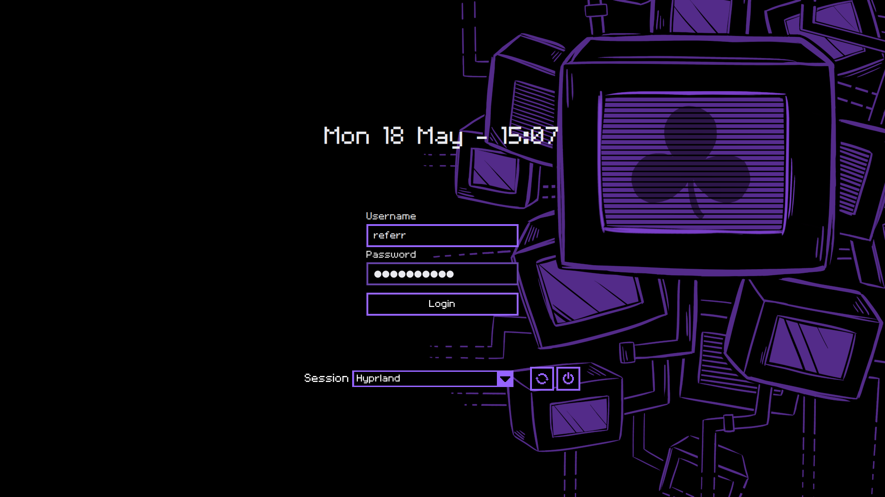

# The World Machine Theme for SDDM
A simple SDDM theme inspired by OneShot: World Machine Edition.



This theme is based on some random theme I found in the KDE Store (don't remember the name of original theme). I've heavily modified it to make it look like the World Machine interface.

Tested on Arch Linux with SDDM 0.21.0.

## Installation
1. Clone this repository:
```bash
git clone https://github.com/ref-err/twm-sddm-theme
```
2. Copy theme folder to SDDM themes:
```bash
sudo cp -r twm-sddm-theme /usr/share/sddm/themes
```
3. Set the theme in KDE System Settings or /etc/sddm.conf:
```
[Theme]
Current=twm-sddm-theme
```

## Bugs
Currently, there is one known bug related to the session selection panel. Please report any bugs in the repository’s Issues tab.

## License
This theme is licensed under [MIT license](LICENSE).

OneShot and related assets belong to Future Cat LLC.
